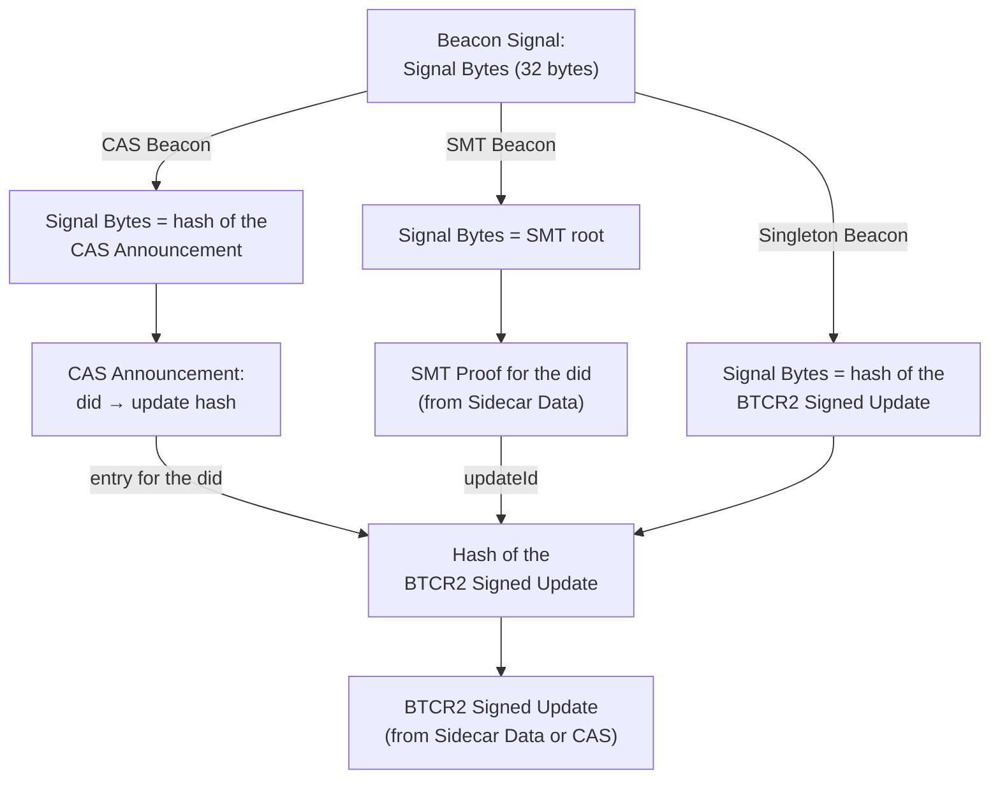
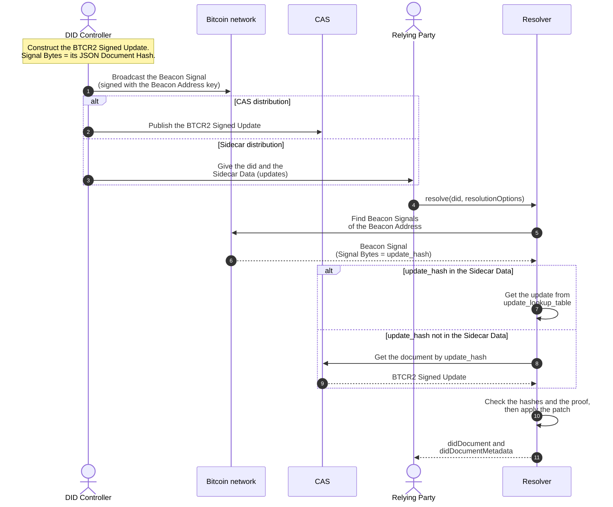
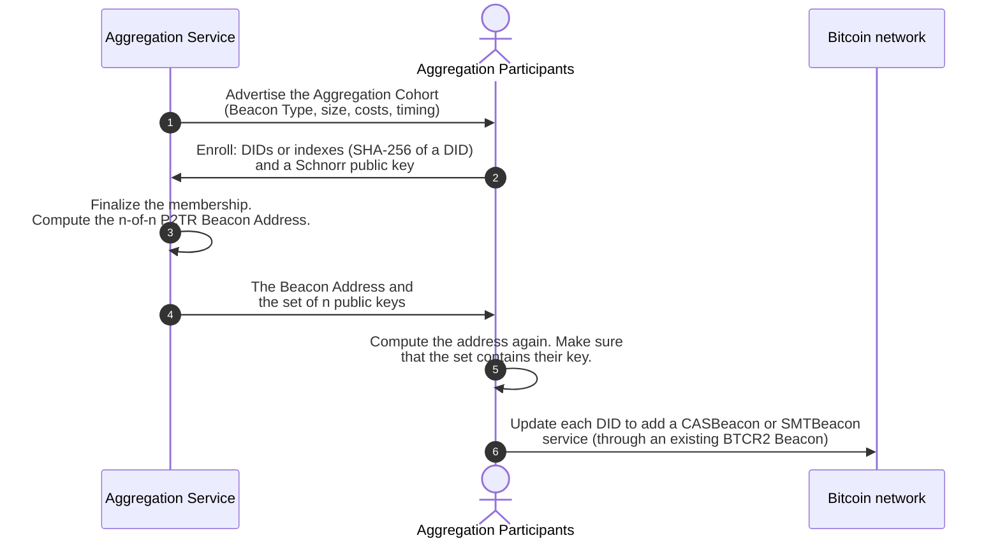
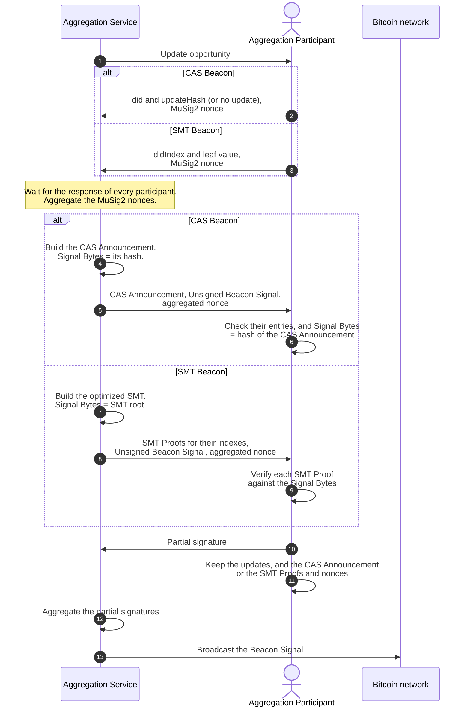
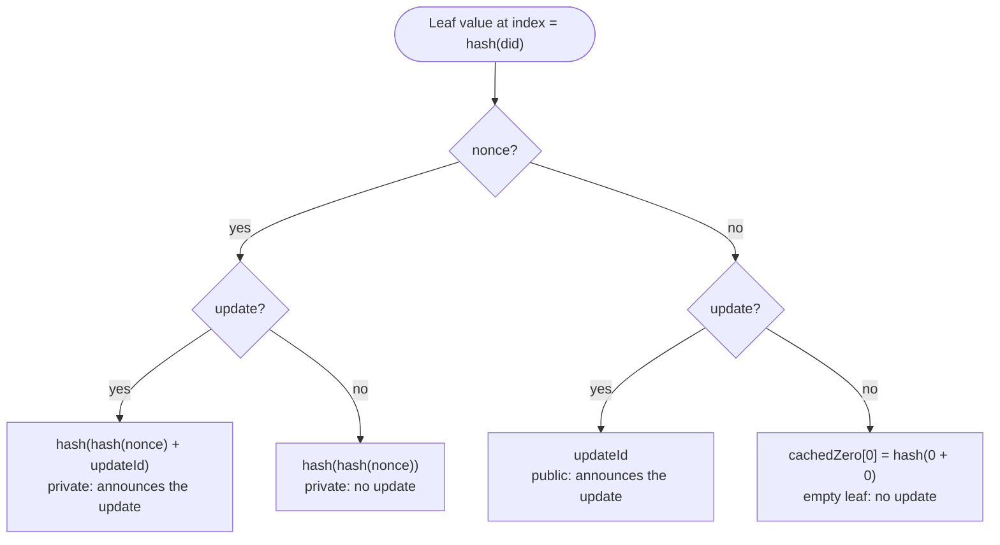
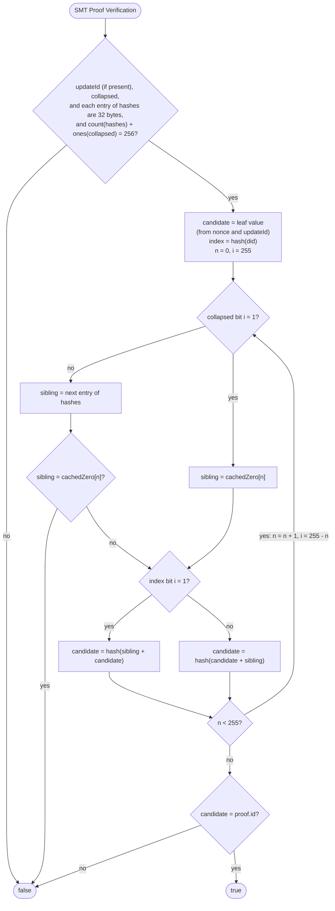

A [BTCR2 Beacon](https://dcdpr.github.io/did-btcr2/beacons.html) is a service in the DID document. Its
`serviceEndpoint` is a Beacon Address. Each Beacon Signal from that address commits to 32 Signal Bytes. The Beacon
Type tells the resolver how to find the update for a DID from these bytes.

## Beacon Types

| Beacon Type | Service `type` | Signal Bytes | Resolver data for each Beacon Signal |
|:------------|:---------------|:-------------|:-------------------------------------|
| Singleton Beacon | `SingletonBeacon` | Hash of the BTCR2 Signed Update | BTCR2 Signed Update |
| CAS Beacon | `CASBeacon` | Hash of the CAS Announcement | CAS Announcement, and the BTCR2 Signed Update if there is an entry for the DID |
| SMT Beacon | `SMTBeacon` | Root of an optimized Sparse Merkle Tree | SMT Proof (Sidecar Data only), and the BTCR2 Signed Update if the proof has an `updateId` |

The resolver needs this data for each Beacon Signal of the Beacon Address. This includes the signals that announce no
update for the DID. Include at least one Singleton Beacon as a fallback, in case all Aggregate Beacons fail.

## Singleton Beacon

The DID controller controls the Beacon Address of a Singleton Beacon. Thus the DID controller signs and broadcasts
each Beacon Signal. There is no Aggregation Cohort.

## Aggregate Beacons

A CAS Beacon or an SMT Beacon puts the updates of many DIDs into one Beacon Signal. An
[Aggregation Service](https://dcdpr.github.io/did-btcr2/beacons/aggregate-beacons.html) coordinates the Aggregation
Participants of an Aggregation Cohort. The specification gives a RECOMMENDED example protocol with MuSig2 (BIP327).
The diagrams show this example. A full aggregation protocol is out of scope for the specification.

### Create an Aggregation Cohort

The Beacon Address is an `n-of-n` Pay-to-Taproot (P2TR) address. Each Aggregation Participant gives one of the `n`
keys. Thus each Beacon Signal needs a signature from every participant. The Aggregation Service is minimally trusted.

### Aggregate and broadcast a Beacon Signal

Each update opportunity needs a response from every Aggregation Participant, also if the participant has no update.
In the pull flow, the Aggregation Service announces the opportunity. In the push flow, the participants send updates
when they are ready.

## SMT leaf values

The leaf index of a DID is the SHA-256 hash of the DID. The DID controller selects the leaf value for each index and
each Beacon Signal. A `nonce` hides from other parties if there is an update. The DID controller must keep each
`nonce` for the life of the DID.

## SMT Proof Verification

The [SMT Proof Verification](https://dcdpr.github.io/did-btcr2/algorithms.html#smt-proof-verification) algorithm walks
from the leaf to the root. `hash()` is SHA-256. `+` joins two 32-byte values. Decode the `base64url` fields of the SMT
Proof before the walk. `cachedZero[n]` is the value of an empty subtree at height `n`.

Bit `0` of a 32-byte value is the most significant bit of the first byte. Thus the walk starts with the last bit of
the index at the leaf. It stops with the first bit at the root.
