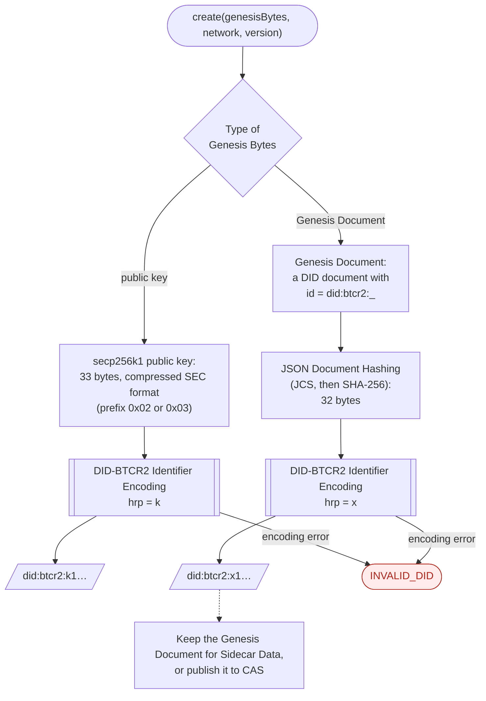
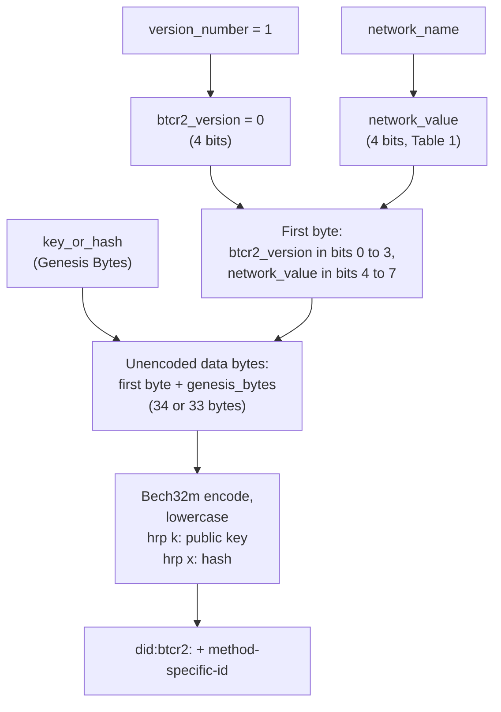

The [Create](https://dcdpr.github.io/did-btcr2/operations/create.html) operation makes a did:btcr2 identifier from
three values: [Genesis Bytes](https://dcdpr.github.io/did-btcr2/terminology.html#genesis-bytes), a Bitcoin network,
and a specification version. Create is offline: it does not use the Bitcoin network or CAS.

## Create operation

The Genesis Bytes are one of two types:

- A secp256k1 public key. The result is a key-based `k1` DID.
- The hash of a [Genesis Document](https://dcdpr.github.io/did-btcr2/data-structures.html#genesis-document). The
  result is a document-based `x1` DID. A resolver needs the Genesis Document to resolve the DID.

A Genesis Document can have more than one verification method and more than one BTCR2 Beacon. It can also have
Aggregate Beacons and other service endpoints. To make an updatable DID, include at least one `capabilityInvocation`
verification method and at least one BTCR2 Beacon service.

## Identifier encoding

The [DID-BTCR2 Identifier Encoding](https://dcdpr.github.io/did-btcr2/algorithms.html#did-btcr2-identifier-encoding)
algorithm packs the version, the network, and the Genesis Bytes into one Bech32m string. The
[decoding](https://dcdpr.github.io/did-btcr2/algorithms.html#did-btcr2-identifier-decoding) algorithm does the
inverse operation.

The bit numbers count from the left of the byte. Thus the first byte of a `mutinynet` DID is `0x05`.

| `network_name` | `network_value` |
|:---------------|:----------------|
| `bitcoin` | `0` |
| `signet` | `1` |
| `regtest` | `2` |
| `testnet3` | `3` |
| `testnet4` | `4` |
| `mutinynet` | `5` |
| Reserved | `6` to `11` |
| Custom networks | `12` to `15` |
