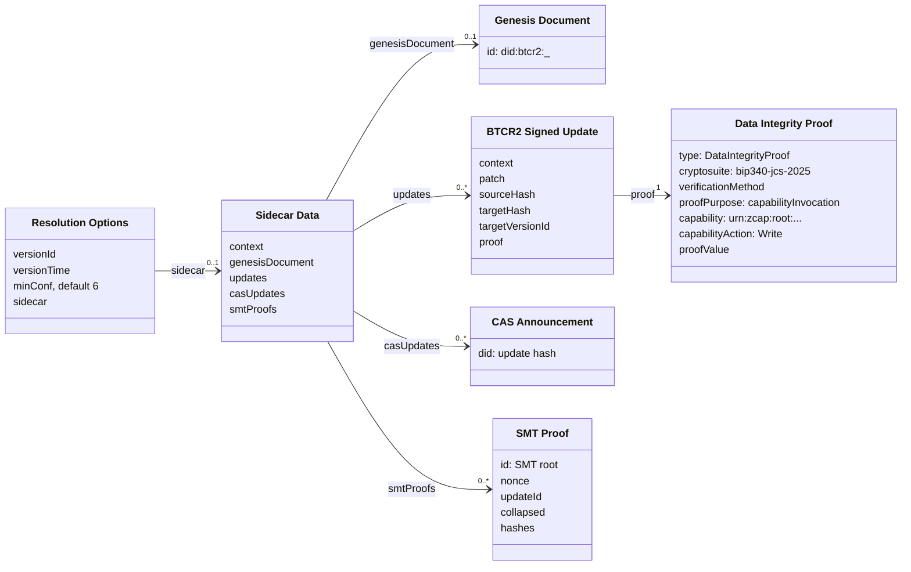
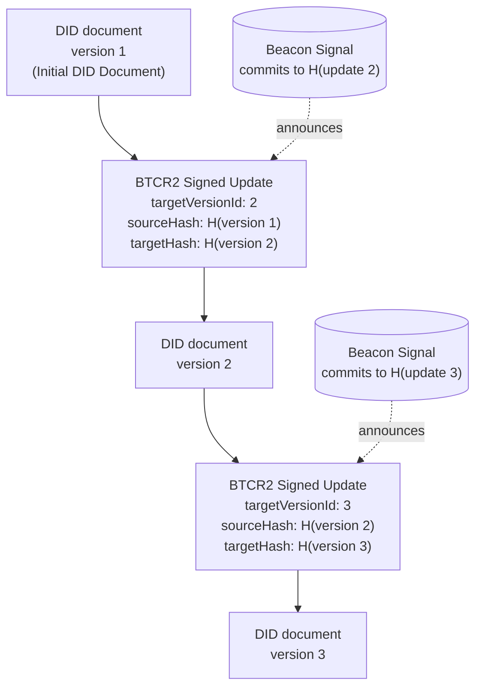
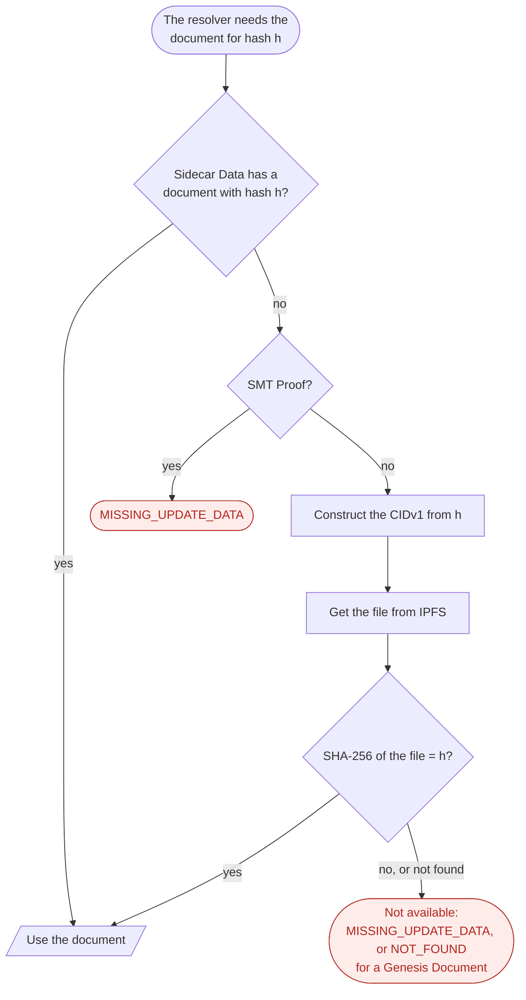
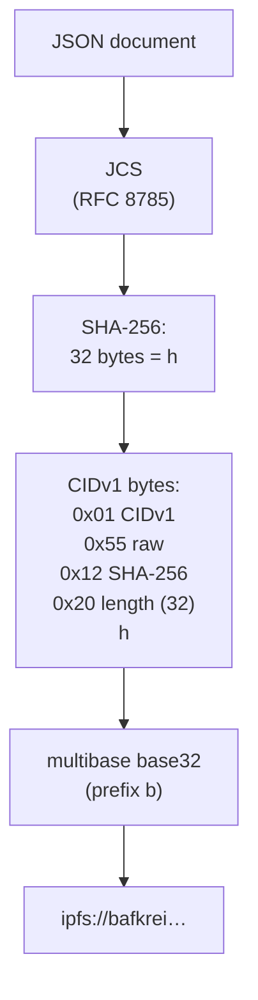

The [Data Structures](https://dcdpr.github.io/did-btcr2/data-structures.html) chapter defines each structure. All
SHA-256 hashes in these structures are `base64url` strings without padding.

## Resolution inputs

The class diagram shows the data that a resolver receives in `resolutionOptions`. All properties of the Sidecar Data
are optional. An `x1` DID needs a Genesis Document, from the Sidecar Data or from CAS.

The `context` rows are the `@context` properties.

## Update hash chain

Each BTCR2 Signed Update links two versions of the DID document through their hashes. A Beacon Signal commits to the
hash of each update. `H()` is the [JSON Document Hashing](https://dcdpr.github.io/did-btcr2/algorithms.html#json-document-hashing)
algorithm: JCS, then SHA-256.

A Singleton Beacon Signal holds the hash of the update. A CAS Beacon Signal or an SMT Beacon Signal commits to the hash
through a CAS Announcement or an SMT root.

## Update data distribution

The resolver gets documents through [Sidecar Data or CAS](https://dcdpr.github.io/did-btcr2/update-data-distribution.html).
It identifies each document by its hash. Use one distribution mechanism for the life of a DID. Documents on CAS are
public. For privacy, use Sidecar Data.

## CID construction

A resolver makes an IPFS CIDv1 from the SHA-256 hash of a document. The file in IPFS is a raw block. Thus the file
bytes are the JCS bytes of the document.

