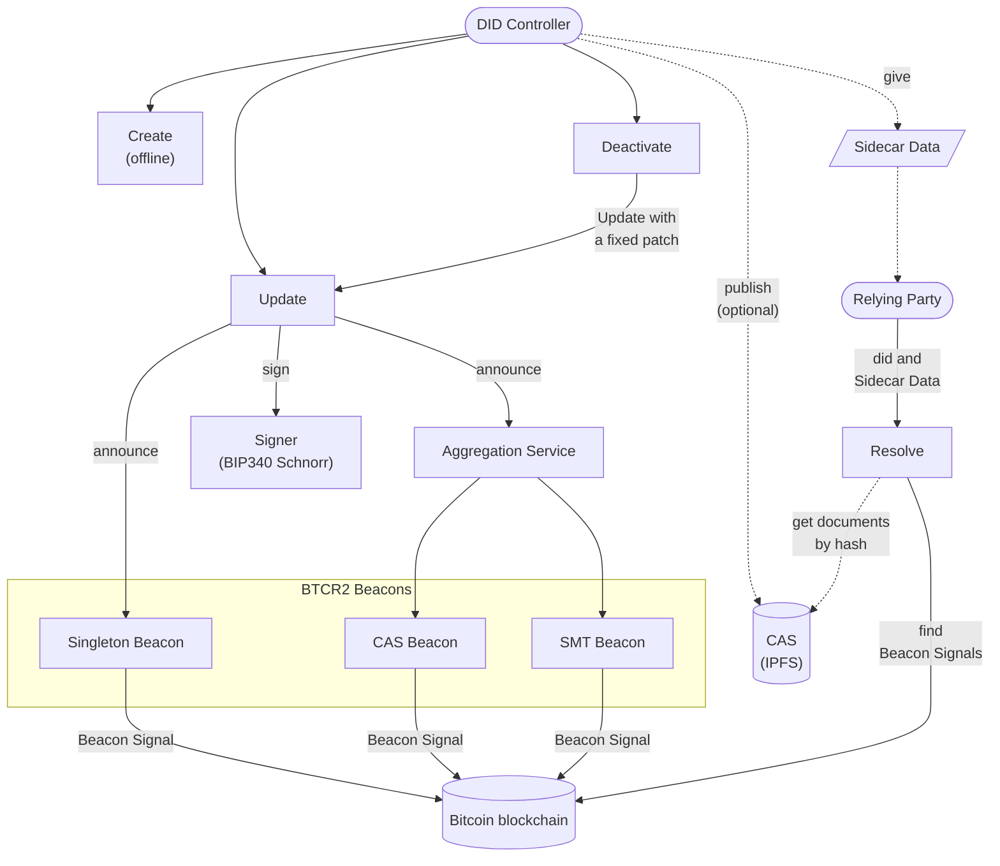
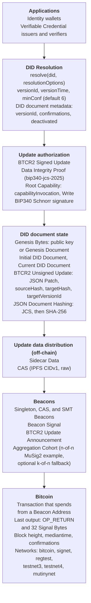
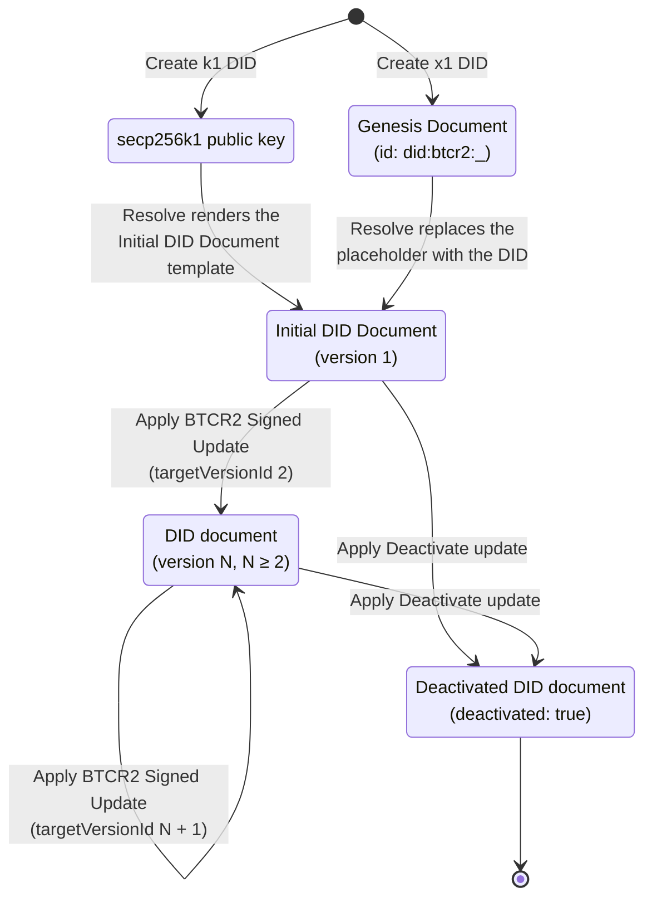

These diagrams show the parts of the [did:btcr2 specification](https://dcdpr.github.io/did-btcr2/) and how they interact.
They do not describe a specific implementation.
The diagrams use the terms of the specification. The [Terminology](https://dcdpr.github.io/did-btcr2/terminology.html)
chapter defines them. If a diagram and the specification do not agree, the specification is correct.

| Page | Diagrams |
|:-----|:---------|
| [Create](/diagrams/create/) | The Create operation and the identifier encoding |
| [Resolve](/diagrams/resolve/) | The Resolve operation and each of its steps |
| [Update and Deactivate](/diagrams/update/) | The Update and Deactivate operations and the Beacon Signal transaction |
| [Beacons](/diagrams/beacons/) | Beacon Types, update aggregation, and SMT proofs |
| [Data](/diagrams/data/) | Data structures, the update hash chain, and update data distribution |

## Architecture

The architecture diagram shows the actors, the four operations, and the systems that they use.
Solid arrows show calls and on-chain data. Dashed arrows show off-chain data.

## Protocol layers

The protocol layers diagram groups the parts of did:btcr2 into layers, from the applications down to the Bitcoin
blockchain. Each layer uses the layer below it.

## DID document lifecycle

The state diagram follows one DID document from its creation to its deactivation. A DID starts with offline
creation. Each applied BTCR2 Signed Update makes a new version. Deactivation is permanent.

