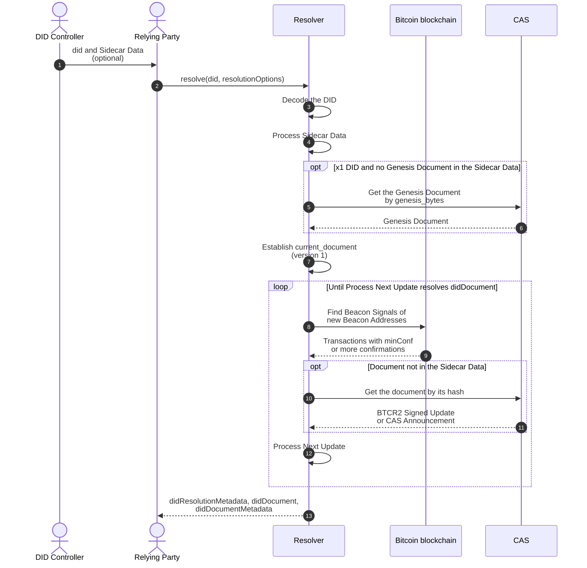
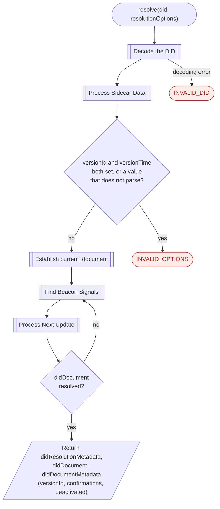
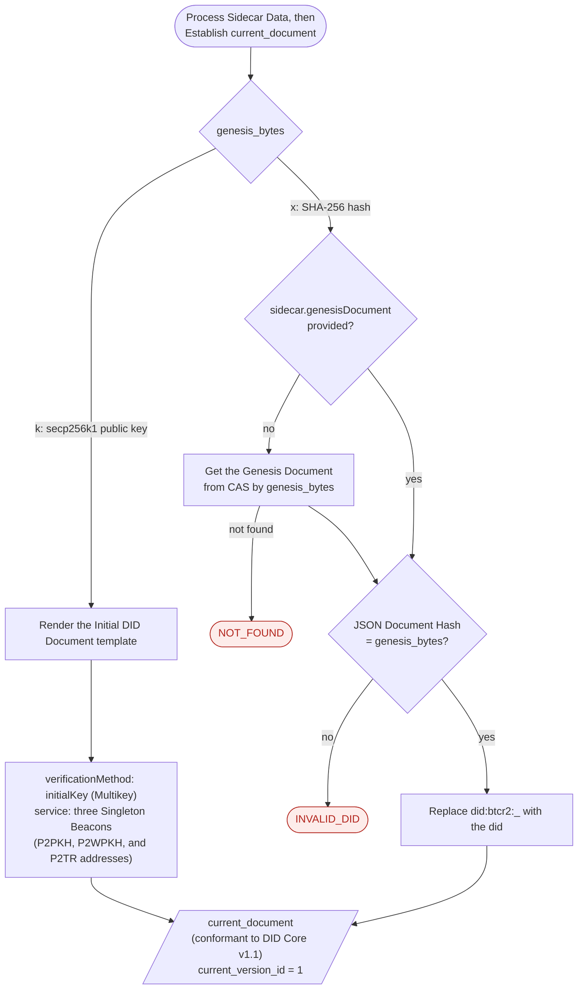
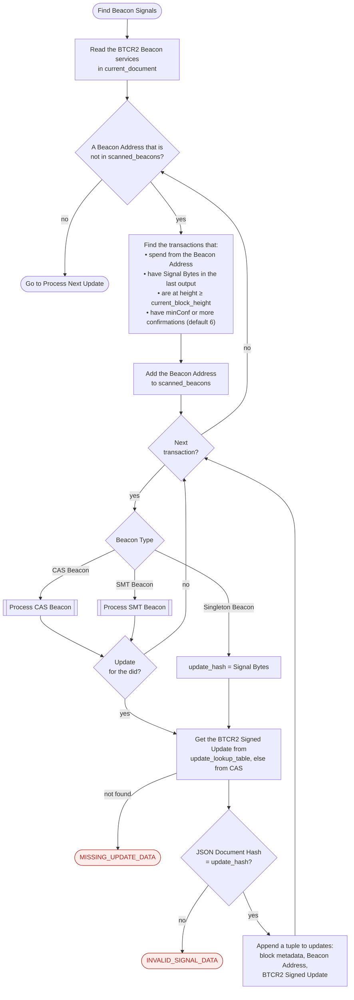
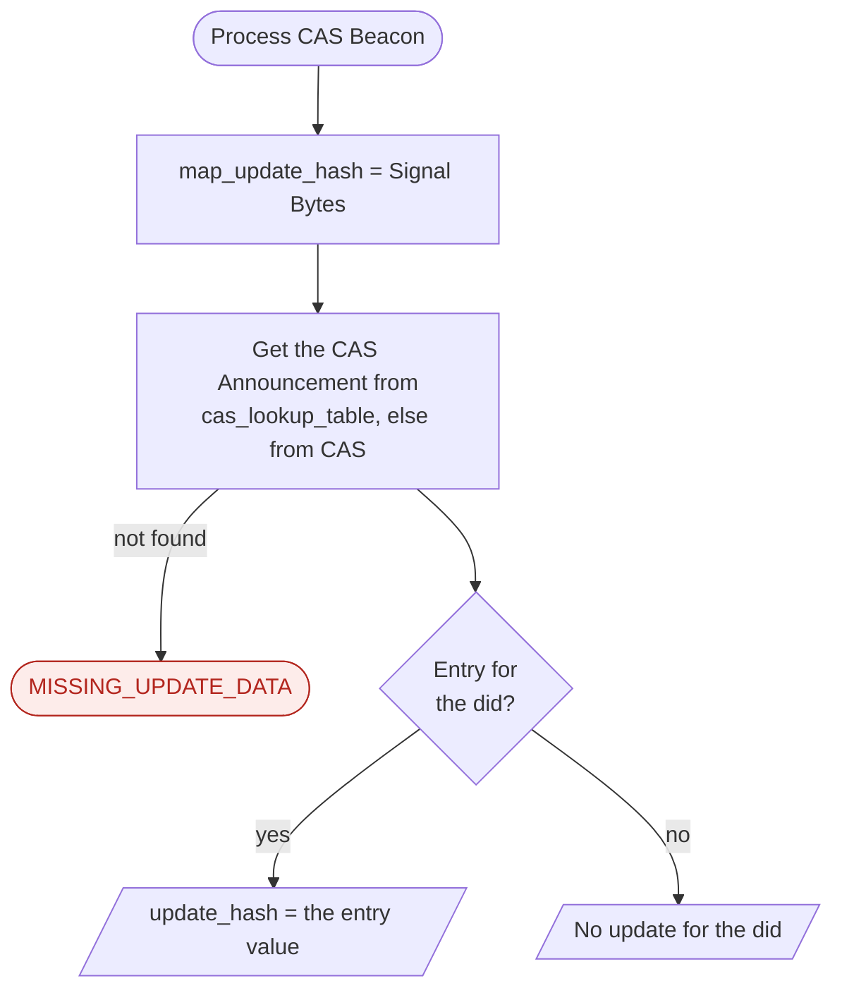
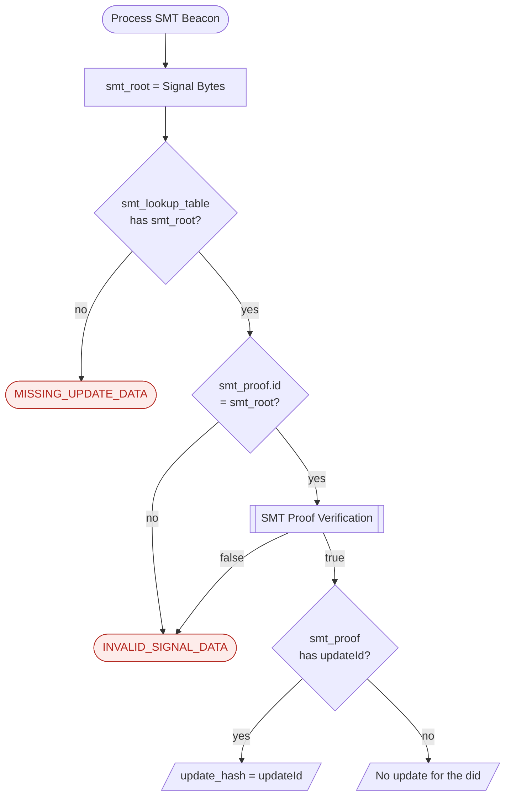
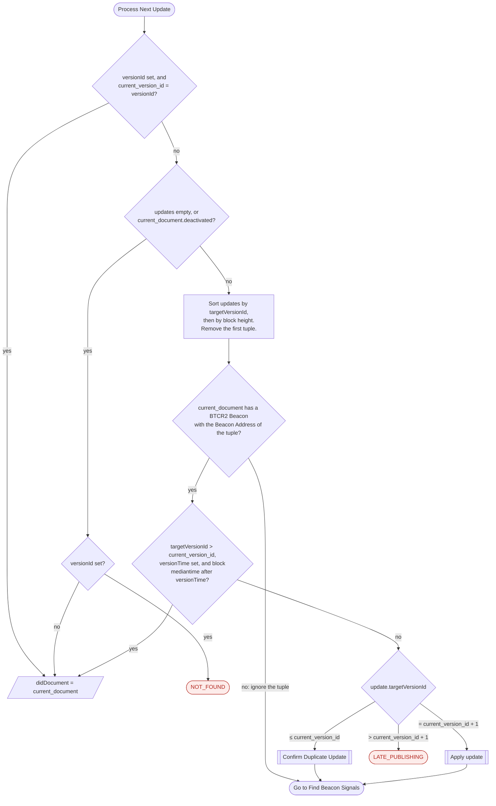
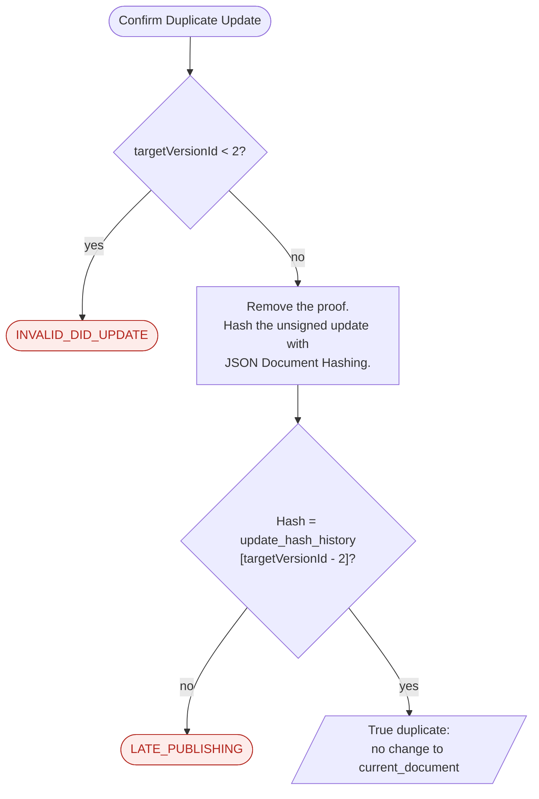
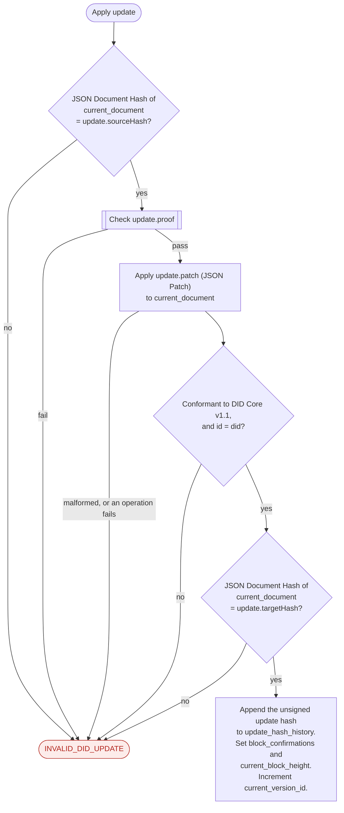
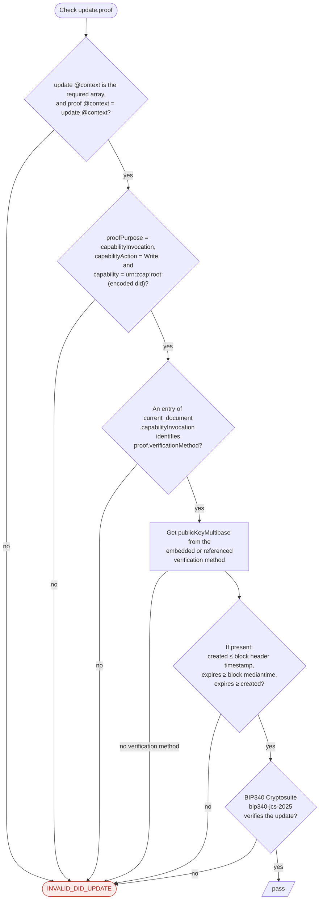

The [Resolve](https://dcdpr.github.io/did-btcr2/operations/resolve.html) operation builds a DID document. It starts
with the Initial DID Document. Then it applies the BTCR2 Signed Updates that Authorized Beacon Signals announce on the
Bitcoin blockchain.

The resolver keeps this state:

- `updates`: tuples of block metadata, a Beacon Address, and a BTCR2 Signed Update.
- `scanned_beacons`: the Beacon Addresses that the resolver scanned.
- `current_document`: the Current DID Document.
- `current_version_id`: the version of `current_document`. The start value is `1`.
- `update_hash_history`: the hashes of the applied BTCR2 Unsigned Updates.
- `block_confirmations` and `current_block_height`: the block of the last applied update.

## Resolution sequence

The sequence diagram shows the messages between the parties. The Sidecar Data is optional. If the resolver does not
find a document in the Sidecar Data, it gets the document from CAS.

## Resolve process

Resolution is a loop of two steps: Find Beacon Signals, then Process Next Update. The loop stops when Process Next
Update resolves `didDocument` or raises an error.

## Establish current_document

[Process Sidecar Data](https://dcdpr.github.io/did-btcr2/operations/resolve.html#process-sidecar-data) makes lookup
tables from the Sidecar Data. For an `x1` DID, it also gets and checks the Genesis Document.
[Establish current_document](https://dcdpr.github.io/did-btcr2/operations/resolve.html#establish-current-document)
then makes the Initial DID Document.

## Find Beacon Signals

[Find Beacon Signals](https://dcdpr.github.io/did-btcr2/operations/resolve.html#find-beacon-signals) scans each new
Beacon Address in `current_document`. An update can add a BTCR2 Beacon. The next loop then scans the new Beacon
Address. The resolver must not use unconfirmed mempool transactions.

### Process CAS Beacon

A Beacon Signal of a CAS Beacon commits to a CAS Announcement. The CAS Announcement maps each DID to the hash of its
BTCR2 Signed Update.

### Process SMT Beacon

A Beacon Signal of an SMT Beacon commits to the root of a Sparse Merkle Tree. The SMT Proof must come from the Sidecar
Data. The resolver does not get SMT Proofs from CAS.

## Process Next Update

[Process Next Update](https://dcdpr.github.io/did-btcr2/operations/resolve.html#process-next-update) applies one
update per loop. It also selects the version that `versionId` or `versionTime` requests.

### Confirm Duplicate Update

A DID controller can announce the same update through more than one BTCR2 Beacon. The resolver accepts a duplicate only
if it is the same as the update that it applied for that version.

### Apply update

[Apply update](https://dcdpr.github.io/did-btcr2/operations/resolve.html#apply-update) checks the update against the
two DID document hashes and the proof. Each failed check raises `INVALID_DID_UPDATE`.

### Check update.proof

[Check update.proof](https://dcdpr.github.io/did-btcr2/operations/resolve.html#check-update-proof) makes sure that a
`capabilityInvocation` key of `current_document` signed the update. The time checks use the block that contains the
Beacon Signal.

