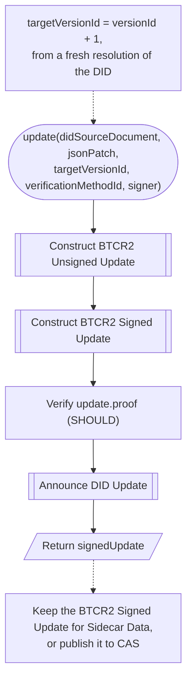
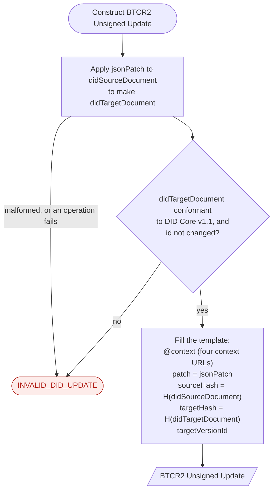
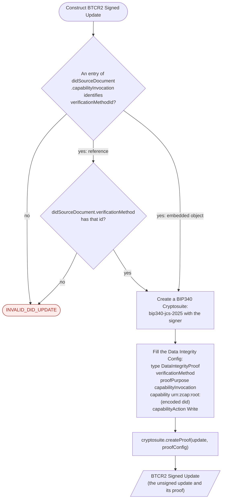
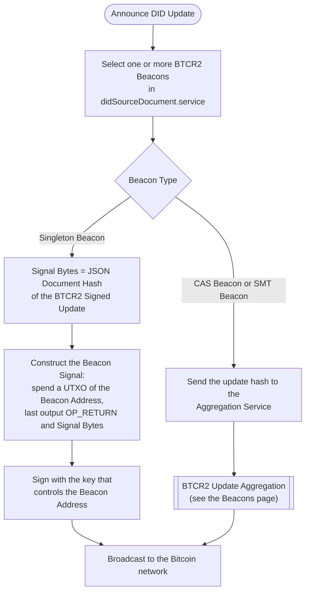
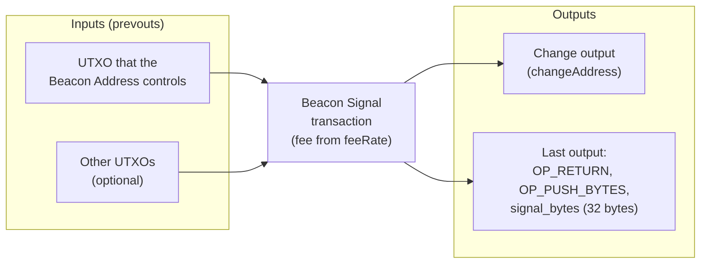
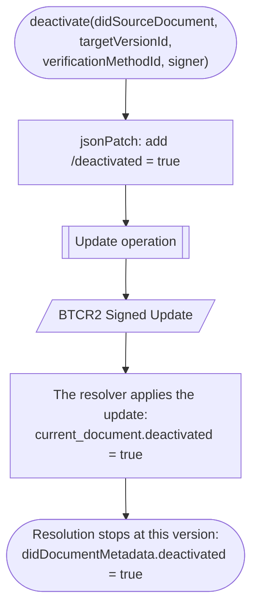

The [Update](https://dcdpr.github.io/did-btcr2/operations/update.html) operation changes a DID document. The DID
controller makes a BTCR2 Signed Update and announces it through one or more BTCR2 Beacons of the DID document. The
[Deactivate](https://dcdpr.github.io/did-btcr2/operations/deactivate.html) operation is an Update with a fixed patch.

## Update operation

The update has three steps. The resolver of each relying party finds the update later through its Beacon Signal.



Use the `versionId` of a fresh resolution for `targetVersionId`. Do not use a local count. An announced update with an
incorrect `targetVersionId` or an incorrect proof can make the DID unresolvable.

## Construct BTCR2 Unsigned Update

[Construct BTCR2 Unsigned Update](https://dcdpr.github.io/did-btcr2/operations/update.html#construct-btcr2-unsigned-update)
applies the patch and records the hashes of the source and target DID documents. `H()` is the
[JSON Document Hashing](https://dcdpr.github.io/did-btcr2/algorithms.html#json-document-hashing) algorithm.



## Construct BTCR2 Signed Update

[Construct BTCR2 Signed Update](https://dcdpr.github.io/did-btcr2/operations/update.html#construct-btcr2-signed-update)
adds a Data Integrity proof. The proof invokes the root capability of the DID. The signer holds the private key or
has access to it. An external signer is RECOMMENDED.



## Announce DID Update

[Announce DID Update](https://dcdpr.github.io/did-btcr2/operations/update.html#announce-did-update) depends on the Beacon
Type. The DID controller broadcasts the Beacon Signal of a Singleton Beacon. The Aggregation Service broadcasts the
Beacon Signal of an Aggregate Beacon.



## Beacon Signal transaction

A Beacon Signal is a Bitcoin transaction that spends from a Beacon Address. Its last output holds the 32 Signal Bytes.
The inputs, the fee, and the change output are parameters of the
[non-normative funding example](https://dcdpr.github.io/did-btcr2/operations/update.html#funding-a-beacon-signal).



A Beacon Signal is an Authorized Beacon Signal only if its Beacon Address is in the then-current DID document.

## Deactivate operation

Deactivation is permanent. After the resolver applies the deactivation update, resolution stops. The resolver returns
`deactivated: true` in the DID document metadata.



This example shows a BTCR2 Signed Update that deactivates a DID at version 3. The values are shortened.

```json
{
  "@context": [
    "https://w3id.org/json-ld-patch/v1",
    "https://w3id.org/zcap/v1",
    "https://w3id.org/security/data-integrity/v2",
    "https://btcr2.dev/context/v1"
  ],
  "patch": [
    {
      "op": "add",
      "path": "/deactivated",
      "value": true
    }
  ],
  "sourceHash": "Rd9NR_kzIdbPBf9V5Srr5lkr3Qw6pUjr...",
  "targetHash": "HDLiTin4d3Lt-Z5NSh5Kfkhqf4iglDv8...",
  "targetVersionId": 3,
  "proof": {
    "@context": [
      "https://w3id.org/json-ld-patch/v1",
      "https://w3id.org/zcap/v1",
      "https://w3id.org/security/data-integrity/v2",
      "https://btcr2.dev/context/v1"
    ],
    "type": "DataIntegrityProof",
    "cryptosuite": "bip340-jcs-2025",
    "verificationMethod": "did:btcr2:k1q5p...#initialKey",
    "proofPurpose": "capabilityInvocation",
    "capability": "urn:zcap:root:did%3Abtcr2%3Ak1q5p...",
    "capabilityAction": "Write",
    "proofValue": "z313jDDznRsbnr85HMnVFRrLYxsrbQFB..."
  }
}
```
